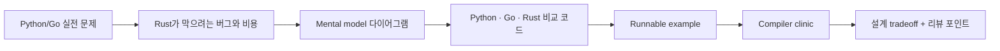

## 누구를 위한 책인가

- Python/Go로 이미 도구나 서비스를 만든 적이 있지만 Rust의 ownership, lifetime, async에서 자주 막히는 개발자
- "borrow checker가 짜증난다"는 감각을 넘어 "이 제약이 어떤 사고를 막는가"까지 이해하고 싶은 개발자
- 문서와 예제가 금방 어긋나는 튜토리얼 대신, 실제로 실행되는 코드와 함께 학습하고 싶은 개발자

## 이 책이 노리는 수준

이 handbook은 Rust 입문을 빨리 끝내는 책이 아니라, Rust를 써서 설계하고 리뷰하고 디버깅하는 기준을 만드는 책을 목표로 한다.

::: tip 현실적인 기준
이 책 하나만 읽는다고 바로 시니어라는 직함이 생기지는 않는다. 대신 "왜 이 제약이 필요한가", "어떤 설계 냄새를 봐야 하는가", "컴파일러와 런타임이 어디서 비용을 드러내는가"를 빠르게 체화하도록 만드는 쪽으로 집필한다.
:::

## 이 책이 다루는 방식

::: tip 학습 원칙
이 handbook은 Rust를 "모든 곳에서 clone 하지 않기 위한 언어"가 아니라 "메모리와 동시성 관계를 타입으로 설계하는 언어"로 설명한다.
:::

## 각 개념을 어디까지 파고드는가

- Ownership: move/borrow 문법을 넘어서 API 경계, 복사 비용, mutation scope, clone 냄새까지 다룬다.
- Lifetimes: annotation 문법 자체보다 zero-copy 설계, 시그니처 관계, 구조체 설계 재검토 기준까지 연결한다.
- Traits: 재사용 문법이 아니라 capability contract, ergonomics, error conversion, public API 안정성 관점으로 본다.
- Async/Tokio: runtime 사용법을 넘어서 `Send`/`Sync`, cancellation, backpressure, lock 경계, task 설계 판단까지 묶는다.

## 파일럿 챕터

- [Ownership 입문](/part-2/ownership)
- [Lifetime 심화](/part-4/lifetimes)
- [Tokio 입문](/part-5/tokio)

## 전체 로드맵

<BookRoadmap />
