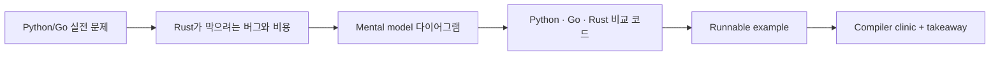

## 누구를 위한 책인가

- Python/Go로 이미 도구나 서비스를 만든 적이 있지만 Rust의 ownership, lifetime, async에서 자주 막히는 개발자
- "borrow checker가 짜증난다"는 감각을 넘어 "이 제약이 어떤 사고를 막는가"까지 이해하고 싶은 개발자
- 문서와 예제가 금방 어긋나는 튜토리얼 대신, 실제로 실행되는 코드와 함께 학습하고 싶은 개발자

## 이 책이 다루는 방식

::: tip 학습 원칙
이 handbook은 Rust를 "모든 곳에서 clone 하지 않기 위한 언어"가 아니라 "메모리와 동시성 관계를 타입으로 설계하는 언어"로 설명한다.
:::

## 파일럿 챕터

- [Ownership 입문](/part-2/ownership)
- [Lifetime 심화](/part-4/lifetimes)
- [Tokio 입문](/part-5/tokio)

## 전체 로드맵

<BookRoadmap />
