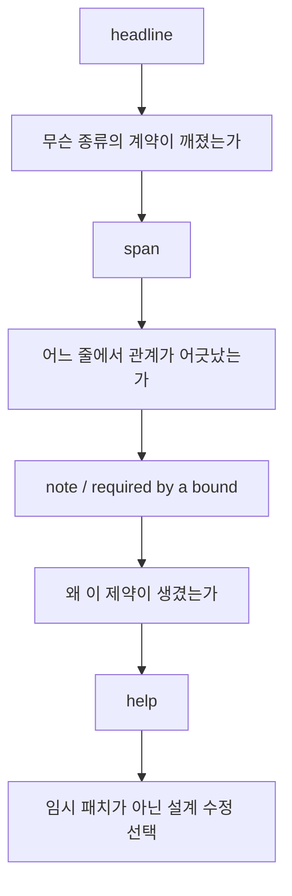

Rust compiler diagnostics는 "틀렸습니다"라고 끝나는 메시지가 아니다. 대부분의 에러는 이미 꽤 정확하게 실패 원인과 필요한 계약을 드러낸다. 문제는 메시지가 길어서 당황하기 쉽다는 점이다.

## 문제 제기

Python이나 Go에서 에러를 읽는 습관으로 Rust 컴파일 에러를 보면, 메시지 길이 때문에 먼저 압도되기 쉽다. 하지만 Rust의 진짜 특징은 길이가 아니라 구조다. headline, span, note, help, required by a bound가 각각 다른 역할을 한다.

## 왜 필요한가

## 에러를 읽는 네 단계

### 1. headline에서 실패 종류를 분류한다

- move 이후 사용인가
- 동시에 두 군데서 빌리려는가
- lifetime 관계가 부족한가
- `Send`/`'static` 같은 async bound가 깨졌는가
- interior mutability가 필요한데 immutable container를 고른 것인가

### 2. span에서 owner와 borrower를 찾는다

에러가 가리키는 줄만 보면 반쪽이다. move가 일어난 줄, borrow가 잡힌 줄, bound를 요구한 API 줄을 함께 봐야 한다.

### 3. note와 help에서 "왜"를 읽는다

Rust는 종종 "captured value is not `Send`", "required by a bound in `tokio::spawn`"처럼 제약의 출처를 같이 보여 준다. 이 note를 읽어야 surface fix가 아니라 진짜 원인을 본다.

### 4. fix를 고르기 전에 설계를 묻는다

- `clone`이 맞는가, 아니면 borrow면 충분한가
- owned boundary를 만들어야 하는가
- `async move`가 필요한가
- `Rc` 대신 `Rc<RefCell<T>>` 또는 `Arc<T>`가 필요한가

## 진단 카테고리별 예시

### Move 이후 사용

<<< ../../examples/ui-harness/tests/ui/use_after_move.rs#use-after-move [Rust]

이 경우 질문은 단순하다. 정말 ownership 이전이 필요했는가, 아니면 borrowed API가 더 맞았는가.

### Lifetime 관계 부족

<<< ../../examples/ui-harness/tests/ui/borrowed_value_does_not_live_long_enough.rs#missing-lifetime [Rust]

이 경우는 annotation 암기보다 "반환값이 어떤 입력을 가리키는가"를 먼저 적어야 한다.

### Async bound 깨짐: `Send`

<<< ../../examples/ui-harness/tests/ui/tokio_spawn_requires_send.rs#non-send-spawn [Rust]

여기서는 `tokio::spawn`이 왜 `Send`를 요구하는지와, `Rc<T>`가 왜 다른 스레드 경계에 맞지 않는지를 같이 읽어야 한다.

### Async bound 깨짐: `'static`

<<< ../../examples/ui-harness/tests/ui/tokio_spawn_borrows_local.rs#borrowed-local-spawn [Rust]

`tokio::spawn`은 task가 현재 함수보다 오래 살 수 있다고 가정한다. 그래서 지역 변수를 빌려 가는 future는 막힌다. 이때는 `async move`로 ownership을 넘길지, spawn 경계를 다시 그릴지 판단해야 한다.

### Interior mutability가 필요한데 container가 잘못됨

<<< ../../examples/ui-harness/tests/ui/rc_mutation_without_refcell.rs#rc-mutation-without-refcell [Rust]

`Rc<T>`는 shared ownership만 준다. mutable access까지 필요하면 `RefCell<T>` 같은 다른 계약이 추가로 필요하다.

## 리뷰에서 보는 포인트

- compiler error를 없애기 위해 `clone`, `Arc<Mutex<_>>`, `'static`을 즉흥적으로 붙이지 않았는가
- note와 help가 가리키는 bound source를 실제로 읽고 수정했는가
- 에러가 말하는 계약을 API surface에 더 정직하게 드러냈는가

## Takeaway

- Rust compiler diagnostics는 길지만 구조적이다.
- headline만 보지 말고 note, bound source, help를 함께 읽어야 한다.
- 좋은 fix는 에러를 숨기는 fix가 아니라 관계를 더 명확하게 만드는 fix다.
