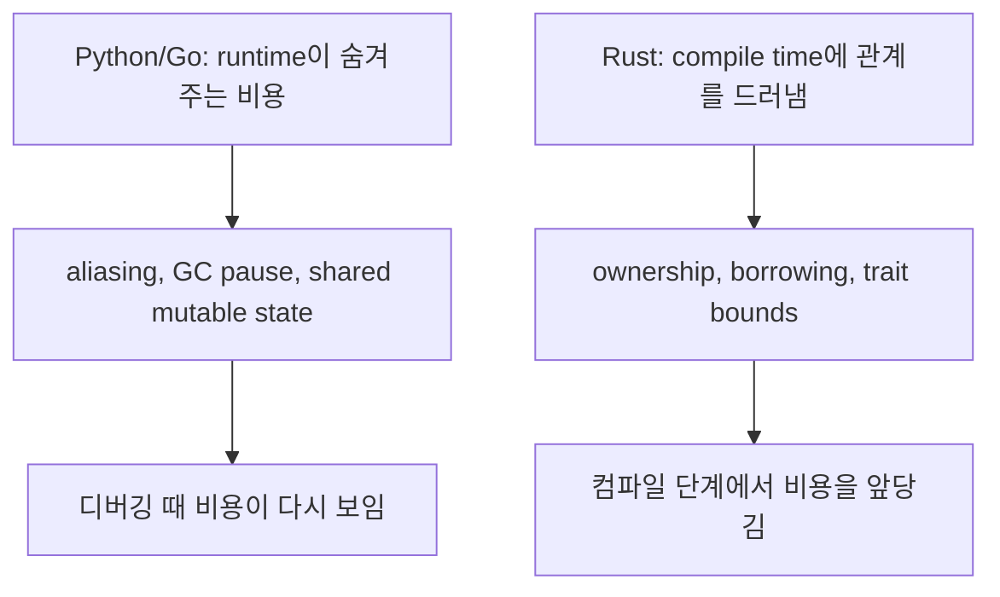

Rust는 메모리를 직접 만져야 하는 언어라서 어려운 것이 아니다. 메모리와 동시성의 관계를 컴파일러가 확인할 수 있게끔 API와 데이터 흐름을 더 명시적으로 써야 해서 어렵다.

## 왜 여기서 시작하는가

- Python은 GC가 수명 관리 비용을 런타임에 지불한다.
- Go는 escape analysis와 GC로 많은 aliasing을 런타임에서 감당한다.
- Rust는 같은 비용을 런타임에 미루지 않고, ownership과 trait contract로 앞단에 끌어온다.

## 이 파트에서 맞출 감각

- stack과 heap을 "빠르다/느리다"가 아니라 "누가 값을 소유하고 정리하느냐"로 본다.
- compiler error를 실패 메시지가 아니라 설계 피드백으로 읽는다.
- `clone`은 쉬운 탈출구지만, 장기적으로는 ownership 경계를 흐린다는 점을 계속 의식한다.

## 이 파트를 지나면 할 수 있어야 하는 일

- Rust의 엄격함을 단순한 언어 취향이 아니라 비용 이동 전략으로 설명할 수 있다.
- 함수 시그니처를 보고 ownership 이전, borrow, allocation 가능성을 대략 읽을 수 있다.
- compiler diagnostics를 보고 "문법이 틀렸네"가 아니라 "어떤 관계를 더 드러내야 하는가"를 질문할 수 있다.
- Cargo workspace, toolchain, lint를 학습 보조 도구가 아니라 설계 루프로 활용할 수 있다.

## 실무에서 반복해서 답해야 하는 질문

- 이 값은 정말 owner를 옮겨야 하나, 아니면 borrow면 충분한가
- 지금 겪는 복잡도는 런타임에서 숨겨진 비용인가, 아니면 내가 관계를 아직 명시하지 않은 것인가
- compiler 에러를 우회하려는 패치인가, 설계를 더 정직하게 만들려는 리팩터링인가

## 이 파트가 깊게 들어갈 주제

- memory model을 "누가 drop 책임을 가지는가" 기준으로 읽기
- compiler clinic을 통해 borrow checker 메시지를 해석하는 순서 만들기
- std docs, clippy, rust-analyzer를 실무 판단 보조 도구로 쓰기

## 파일럿 챕터

- [왜 Rust는 이렇게 빡빡하게 느껴질까](/part-1/strictness)

## 현재 파일럿 이후 확장할 주제

<PartRoadmap part-id="mindset-shift" />
