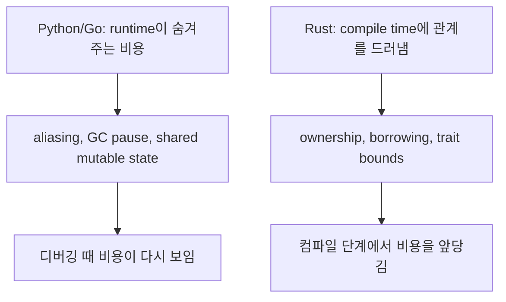

Rust는 메모리를 직접 만져야 하는 언어라서 어려운 것이 아니다. 메모리와 동시성의 관계를 컴파일러가 확인할 수 있게끔 API와 데이터 흐름을 더 명시적으로 써야 해서 어렵다.

## 왜 여기서 시작하는가

- Python은 GC가 수명 관리 비용을 런타임에 지불한다.
- Go는 escape analysis와 GC로 많은 aliasing을 런타임에서 감당한다.
- Rust는 같은 비용을 런타임에 미루지 않고, ownership과 trait contract로 앞단에 끌어온다.

## 이 파트에서 맞출 감각

- stack과 heap을 "빠르다/느리다"가 아니라 "누가 값을 소유하고 정리하느냐"로 본다.
- compiler error를 실패 메시지가 아니라 설계 피드백으로 읽는다.
- `clone`은 쉬운 탈출구지만, 장기적으로는 ownership 경계를 흐린다는 점을 계속 의식한다.

## 현재 파일럿 이후 확장할 주제

<PartRoadmap part-id="mindset-shift" />
