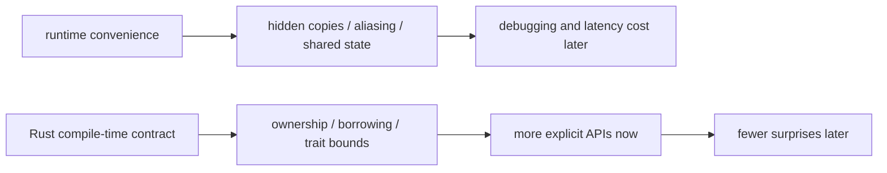

Rust를 처음 접하면 "왜 이렇게까지 컴파일러가 간섭하지?"라는 감각이 먼저 든다. 하지만 Rust의 엄격함은 취향 문제가 아니라, runtime에서 뒤늦게 드러나는 비용과 버그를 compile time으로 끌어오는 전략에 가깝다.

## 문제 제기

Python이나 Go에서는 기능을 빠르게 붙이는 동안 ownership, aliasing, mutation scope를 깊게 드러내지 않아도 되는 경우가 많다. 대신 그 비용은 GC pressure, shared mutable state, hidden copies, 또는 디버깅 복잡도로 나중에 다시 나타난다.

## 왜 필요한가

Rust가 strict하게 느껴지는 건 "자유를 빼앗기 때문"이 아니라, 시스템 비용을 더 일찍 보게 만들기 때문이다.

## Python · Go · Rust 비교

::: code-group
<<< @/snippets/python/runtime_tradeoff.py#hidden-runtime-cost [Python]
<<< @/snippets/go/runtime_tradeoff.go#hidden-runtime-cost [Go]
<<< ../../examples/ownership-playbook/src/lib.rs#promote-title [Rust]
:::

Python과 Go에서도 같은 의도를 표현할 수는 있다. 하지만 Rust는 "이 함수가 ownership을 가져가는가, 빌려 쓰는가"를 더 강하게 시그니처에 남긴다.

## Runtime cost를 compile-time contract로 옮겨 읽기

### 1. Stack vs heap

중요한 건 단순한 속도 비교가 아니다. 값이 어디에 놓이는가보다 "누가 이 값을 소유하고 언제 정리하는가"를 먼저 봐야 한다.

### 2. Ownership

ownership은 메모리 최적화 기법이 아니라 정리 책임과 mutation 권한을 한눈에 드러내는 계약이다.

### 3. Compiler diagnostics

컴파일 에러는 막연한 실패 메시지가 아니라 "지금 API 설계가 어떤 관계를 숨기고 있는가"를 알려주는 피드백이다.

## Runnable example

기존 ownership 예제만 봐도 Rust가 왜 strict하게 보이는지 감이 온다. `&str` 입력은 ownership을 빼앗지 않고, `String` 반환은 새 값을 만든다는 사실을 시그니처에서 바로 보여 준다.

<<< ../../examples/ownership-playbook/src/lib.rs#promote-title [Rust]

읽기 전용 데이터 접근도 같은 식이다. slice를 받는 함수는 값 전체를 복사하지 않고도 필요한 계산을 수행한다.

<<< ../../examples/ownership-playbook/src/lib.rs#borrowed-slice [Rust]

## Compiler clinic

컴파일러 에러는 한 덩어리로 읽지 않는 편이 낫다. Part 1에서 가장 자주 만나는 진단은 크게 네 부류다.

## 진단을 분류해서 읽기

### 1. move 이후 재사용

값의 ownership이 이미 이동했는데 다시 쓰려고 할 때 나온다. Rust는 여기서 "누가 owner인가"를 끝까지 묻는다.

<<< ../../examples/ui-harness/tests/ui/use_after_move.rs#use-after-move [Rust]

### 2. 겹치는 borrow

같은 값을 읽는 참조와 바꾸는 참조가 동시에 살아 있으면 나온다. 이건 보통 scope를 더 좁히거나, `split_*` 같은 API로 disjoint access를 증명해야 한다는 신호다.

<<< ../../examples/ui-harness/tests/ui/borrow_conflict.rs#borrow-conflict [Rust]

### 3. lifetime 관계가 부족함

반환 reference가 입력 중 무엇을 가리키는지 compiler가 추론할 수 없을 때 나온다. 이 경우는 annotation을 마구 늘리는 것보다 ownership boundary를 다시 그리는 편이 더 낫다.

<<< ../../examples/ui-harness/tests/ui/borrowed_value_does_not_live_long_enough.rs#missing-lifetime [Rust]

### 4. task 경계를 넘는 async state

Tokio 같은 runtime에서는 task가 다른 worker thread로 이동할 수 있고, 함수 밖으로 더 오래 살아남을 수 있다. 그래서 `Send`와 `'static`이 진단의 핵심 단서가 된다.

<<< ../../examples/ui-harness/tests/ui/tokio_spawn_requires_send.rs#non-send-spawn [Rust]

<<< ../../examples/ui-harness/tests/ui/tokio_spawn_borrows_local.rs#borrowed-local-spawn [Rust]

이 메시지는 "문법이 틀렸다"보다 "ownership 경계를 다시 생각하라"는 피드백에 가깝다.

## 읽는 순서

1. error code와 첫 문장을 본다.
2. underline이 찍힌 표현식이 ownership 이동인지, borrow 충돌인지, lifetime 관계 문제인지 분류한다.
3. `help`와 `note`를 읽고, compiler가 요구하는 관계를 문장으로 바꿔 본다.
4. 진단을 억지로 피하지 말고, `&T`, `&mut T`, owned value, scope 분리 중 어떤 설계 변경이 맞는지 고른다.

::: tip 읽는 법
컴파일러 에러를 볼 때는 먼저 "이 값의 owner가 누구였나", "여기서 ownership 이전이 정말 필요했나"를 질문하면 된다.
:::

## 언제 이 관점이 중요한가

- 큰 버퍼나 문자열을 여러 계층에서 재사용할 때
- concurrency와 async에서 shared state를 다룰 때
- API를 만들며 "borrow로 충분한가, owned value가 필요한가"를 판단할 때
- compiler diagnostics를 설계 피드백으로 읽고, error category별로 대응법을 정리하고 싶을 때

## 실무 판단 기준

- 함수 인자로 owned type이 보이면 먼저 "이 함수가 정말 소비자(consuming API)인가"를 확인한다.
- `clone`이 추가될 때는 편의성뿐 아니라 allocation 비용과 ownership 설계 신호를 같이 본다.
- compiler 에러를 우회하기 위해 데이터를 전역 mutable state나 `Arc<Mutex<_>>`로 몰아넣는 패치는 경계한다.
- strict함이 불편하게 느껴질수록 "이 비용이 원래는 런타임 어느 지점에서 터졌을까"를 되짚는 습관이 중요하다.
- move, borrow, lifetime, async 진단은 서로 다른 문제처럼 보여도 결국 "관계가 시그니처에 충분히 드러났는가"로 모인다.

## Takeaway

- Rust의 strict함은 비용을 없애는 게 아니라 비용이 보이는 시점을 앞당긴다.
- ownership과 borrowing은 컴파일러를 위한 규칙이 아니라 API 계약을 명시하는 도구다.
- compiler diagnostics를 읽는 감각이 생기면 Rust는 훨씬 덜 답답해진다.
