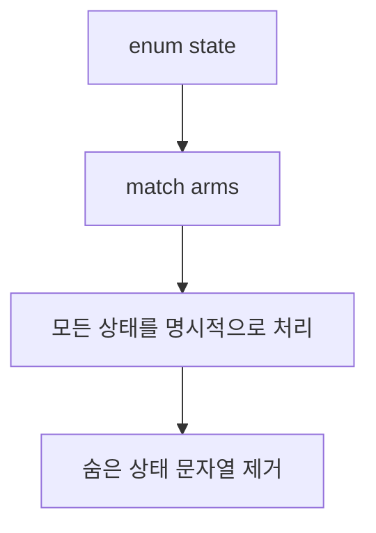

enum은 "여러 값 중 하나"를 담는 컨테이너가 아니다. 상태를 닫아두고, 가능한 분기를 compile time에 고정하는 도구다.

## 문제 제기

Python이나 Go에서는 상태값을 문자열이나 상수로 두고 if/switch를 작성하기 쉽다. Rust의 enum은 상태의 종류를 타입으로 고정해서, 빠뜨린 분기를 compiler가 잡아주게 만든다.

## 왜 필요한가

상태를 문자열로 흩어두면 오타와 누락이 늘어난다. enum은 가능한 상태를 닫아두고, match는 그 상태를 빠짐없이 다루게 한다.

## invalid state를 줄이는 구조로 읽기

enum의 실전 가치는 "variant를 예쁘게 나열한다"가 아니라 "조합이 맞지 않는 상태를 만들지 못하게 한다"는 점이다. `status: String`, `reviewers: usize`, `published: bool` 같은 구조는 겉보기에는 단순하지만, 실제로는 서로 모순되는 조합을 허용하기 쉽다. 반대로 enum은 상태 조합을 타입 시스템 안으로 끌어들여 불가능한 상태를 크게 줄인다.

- 상태가 서로 배타적이면 enum이 맞다.
- 상태별 payload가 다르면 data-carrying variant가 맞다.
- `match`는 그 상태 공간을 빠짐없이 설명하게 만든다.
- 새 variant를 추가했을 때 match가 깨지는 것은 변경 비용을 compiler가 드러낸 것이다.

## Python · Go · Rust 비교

::: code-group
<<< @/snippets/python/enum_match.py#enum-match-compare [Python]
<<< @/snippets/go/enum_match.go#enum-match-compare [Go]
<<< ../../examples/ownership-playbook/src/lib.rs#publishing-state [Rust]
:::

Python과 Go는 관례로 상태를 관리하지만, Rust는 enum으로 상태 집합 자체를 타입 시스템에 넣는다.

## Runnable example

상태에 따라 다른 문구를 만드는 함수는 match로 읽는다.

<<< ../../examples/ownership-playbook/src/lib.rs#publishing-state [Rust]

실행 흐름은 다음 예제로 바로 확인할 수 있다.

<<< ../../examples/ownership-playbook/examples/enum_match.rs#enum-match-main [Rust]

`publication_banner`는 같은 enum을 다른 관점으로 해석하는 예다. 상태를 한 글자 문자열로 던지는 대신, 어떤 상태에서 어떤 문장을 보여줄지 compiler가 다 보게 한다.

<<< ../../examples/ownership-playbook/src/lib.rs#publication-banner [Rust]

## Compiler clinic

enum에 새 variant를 추가하면 match가 깨질 수 있다. 이건 버그가 아니라 compiler가 "모든 상태를 다뤄라"라고 요구하는 신호다.

::: tip 읽는 법
match가 깨질 때는 "내가 새 상태를 추가했는데 처리 로직을 아직 갱신하지 않았다"라고 읽는 편이 맞다.
:::

## 언제 쓰는가 / 피해야 하는가

- 관련된 상태 집합을 닫아두고 싶을 때
- if/else 대신 분기를 타입에 명시하고 싶을 때
- 상태별 로직이 달라져도 누락을 허용하고 싶지 않을 때
- 상태가 너무 동적이라 enum으로 닫을 수 없는 경우에는 과하게 쓰지 않는 편이 낫다

## 실무 판단 기준

- 상태가 `String`이나 여러 bool의 조합으로 퍼지기 시작하면 enum으로 닫을 수 있는지 먼저 본다.
- enum을 쓰면 variant 추가가 API 변경이 될 수 있으므로, public type에서는 확장 방향까지 생각한다.
- `match`의 exhaustive checking은 귀찮은 제약이 아니라 상태 전이를 문서화하는 장치다.
- 값의 shape이 상태에 따라 달라진다면 optional field보다 variant 분리가 더 읽기 쉽다.

## Takeaway

- enum은 상태를 타입으로 닫아두는 도구다.
- match는 그 상태를 빠짐없이 다루게 만드는 도구다.
- 문자열 상태값보다 enum이 더 오래 유지보수하기 쉽다.
