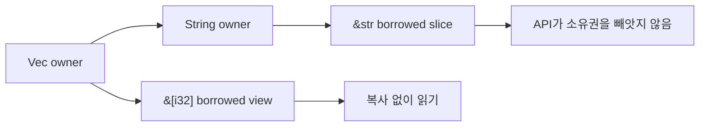

Python이나 Go에서는 함수를 나누면서도 "이 호출이 값을 복사했나, 공유했나, 나중에 누가 바꿀 수 있나"를 깊게 생각하지 않아도 되는 경우가 많다. Rust는 그 관계를 시그니처에서 바로 보이게 만든다.

## 문제 제기

데이터 파이프라인에서 큰 버퍼를 여러 함수가 읽기만 하는데도 매번 `clone`으로 방어하면, 성능 비용과 의도 둘 다 흐려진다. Rust의 borrow는 "읽기 전용으로 잠깐 참조한다"는 의도를 타입으로 고정한다.

## 왜 필요한가

`&[T]`와 `&str`는 "이 함수는 읽기만 한다"는 계약이다. 이 계약이 있으면 호출자는 큰 데이터를 넘겨도 ownership을 잃지 않고, 구현자는 숨은 복사를 하지 않는다.

## Python · Go · Rust 비교

::: code-group
<<< @/snippets/python/ownership_reference.py#hidden-copy [Python]
<<< @/snippets/go/ownership_escape.go#slice-view [Go]
<<< ../../examples/ownership-playbook/src/lib.rs#borrowed-slice [Rust]
:::

Python과 Go도 읽기 전용 스타일의 API를 만들 수는 있지만, Rust처럼 소유권 이동 여부를 타입 차원에서 강하게 표현하진 않는다.

## Runnable example

다음 예제는 `Vec<i32>`의 ownership을 그대로 둔 채 slice만 읽고, `String`은 `&mut String`으로 필요한 범위에서만 수정한다.

<<< ../../examples/ownership-playbook/examples/borrowed_slice.rs#borrowed-slice-main [Rust]

추가로, 문자열을 새로 만들어 돌려주려면 ownership을 명시적으로 얻는 대신 `&str` 입력에서 새 `String`을 만들 수 있다.

<<< ../../examples/ownership-playbook/src/lib.rs#promote-title [Rust]

`&mut`는 더 강한 신호다. 이 함수는 호출자가 가진 값을 직접 바꾼다.

<<< ../../examples/ownership-playbook/src/lib.rs#mutable-borrow [Rust]

## Compiler clinic

ownership은 단순히 "값 하나는 주인 하나"라는 규칙이 아니다. move된 값을 다시 쓰려 하면 컴파일러가 관계가 틀어졌다고 막는다.

<<< ../../examples/ui-harness/tests/ui/use_after_move.rs#use-after-move [Rust]

이 에러를 보면 "그냥 clone하면 되지"가 아니라 "정말 ownership 이전이 필요한가, borrow로 충분한가"를 먼저 점검해야 한다.

::: warning clone이 정답일 때도 있다
작은 값, 명확한 소유권 분리, 비동기 task 경계에서는 clone이 더 읽기 쉽고 안전할 수 있다. 중요한 건 습관적으로 쓰지 않는 것이다.
:::

## 언제 쓰는가 / 피해야 하는가

- `&[T]`, `&str`: 읽기 전용 view를 전달할 때
- `&mut T`: 수정이 반드시 호출자 상태에 반영되어야 할 때
- `T` by value: ownership 이전 자체가 도메인 의미일 때
- 불필요한 `clone`: "왜 ownership이 필요하지?"라는 질문을 회피하게 만들 때

## Takeaway

- ownership은 성능 최적화 기능이 아니라 관계를 명시하는 설계 도구다.
- borrow는 "복사하지 않는다"보다 "ownership을 빼앗지 않는다"는 의미가 더 중요하다.
- `&mut`를 보면 mutation scope와 API 책임이 동시에 드러난다.
