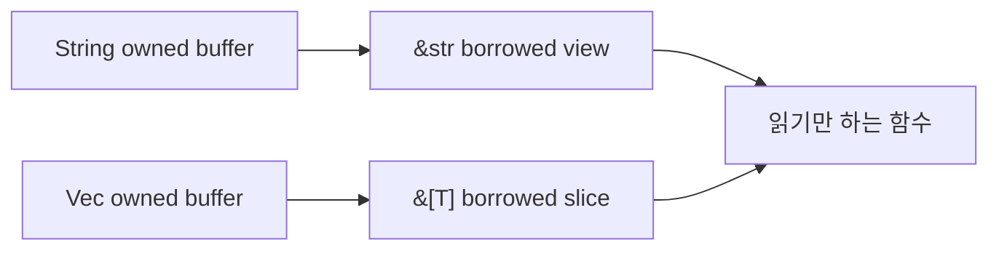

Rust에서 `String`과 `&str`, `Vec<T>`와 `&[T]`는 단순한 타입 쌍이 아니다. 소유권을 넘길 것인지, 읽기용 view만 줄 것인지, API 의도를 어떻게 드러낼 것인지의 문제다.

## 문제 제기

Python이나 Go에서는 문자열과 리스트를 넘길 때 대체로 "읽기 전용처럼 쓰는가"만 생각해도 된다. Rust는 여기에 ownership 경계를 추가해서, 읽기와 소유를 분명히 나눈다.

## 왜 필요한가

`String`과 `Vec<T>`는 데이터를 소유한다. `&str`과 `&[T]`는 이미 있는 데이터를 빌려 읽는다. 이 차이를 구분하면 clone을 덜 쓰고, API도 덜 헷갈린다.

## Boundary에서 normalize하고 내부에서는 view를 유지하기

실무에서는 입력을 항상 빌려 받는다고 해서 출력까지 모두 빌린 상태로 유지할 수 있는 것은 아니다. 정규화, slug 생성, 접두사 추가, 소문자 변환처럼 바이트 자체가 바뀌는 순간에는 새 `String`이 필요하다. 중요한 건 "무조건 owned"가 아니라 "어디에서 소유권이 생기고 어디에서 view로 내려오는가"를 분리해서 보는 것이다.

- 입력 boundary는 `&str`가 기본이다.
- 내부에서 조합하거나 canonical form을 만들 때만 `String`을 만든다.
- 반환값이 호출자에게 다시 저장되어야 하면 `String`이 더 정직하다.
- 단순 읽기 함수에 `String`을 받게 만들면 호출자에게 쓸데없는 ownership 이전을 요구한다.

`normalize_username` 같은 함수는 바로 이 경계를 보여 준다. 입력은 borrowed view로 받고, 결과는 owned value로 돌려준다.

## Python · Go · Rust 비교

::: code-group
<<< @/snippets/python/string_slice.py#string-slice-compare [Python]
<<< @/snippets/go/string_slice.go#string-slice-compare [Go]
<<< ../../examples/ownership-playbook/src/lib.rs#normalize-username [Rust]
:::

Python과 Go에서도 같은 의도를 표현할 수 있지만, Rust는 borrowed view를 타입으로 드러내서 함수를 더 정확히 읽게 한다.

## Runnable example

문자열 입력은 `&str`로 받고, 내부에서 필요한 경우만 `String`으로 바꾼다.

<<< ../../examples/ownership-playbook/src/lib.rs#normalize-username [Rust]

슬라이스는 전체 벡터를 복사하지 않고도 패턴 매칭으로 읽을 수 있다.

<<< ../../examples/ownership-playbook/src/lib.rs#describe-score-window [Rust]

이 흐름을 하나의 실행 예제로 보면 더 직관적이다.

<<< ../../examples/ownership-playbook/examples/string_and_slice.rs#string-slice-main [Rust]

## Compiler clinic

`String`을 받는 함수는 호출자에게 ownership을 넘기라고 요구한다. 읽기만 한다면 `&str`이 더 정확한 계약이다.

`Vec<T>`와 `&[T]`도 같은 원리다. 슬라이스는 데이터의 소유권이 아니라 읽기 범위를 표현한다. 그래서 함수가 전체 버퍼를 소비하지 않아도 된다.

## 언제 쓰는가 / 피해야 하는가

- `&str`: 입력을 읽기만 하고 ownership은 유지시키고 싶을 때
- `String`: 새 문자열을 만들어 반환하거나 소유권이 필요할 때
- `&[T]`: 벡터 전체를 소모하지 않고 읽기만 할 때
- `Vec<T>`: 호출자에게 ownership을 넘겨야 할 때

## 실무 판단 기준

- 문자열 API는 기본적으로 `&str`에서 시작하고, 실제로 새 문자열이 필요할 때만 `String`으로 올린다.
- 값을 정규화하면서 allocation이 생기더라도, 그 비용이 경계와 의미를 명확히 해 주면 충분히 정당할 수 있다.
- `Vec<T>`를 받는 대신 `&[T]`로 충분한 경우가 많다. 컬렉션 전체를 소유해야 할 이유가 없으면 슬라이스를 우선 검토한다.
- `&str`과 `&[T]`는 "읽기만 한다"는 신호고, `String`과 `Vec<T>`는 "소유 책임이 있다"는 신호다.

## Takeaway

- `String`과 `&str`은 소유와 view의 차이다.
- `Vec<T>`와 `&[T]`도 같은 구조다.
- 타입을 보면 함수가 무엇을 빌려 읽고 무엇을 소유하는지 보인다.
