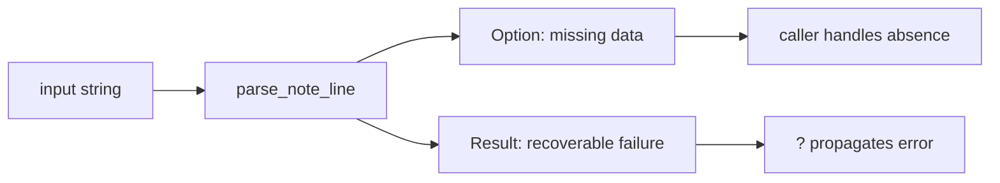

trait와 generic은 "코드를 재사용하는 문법"이 아니라 capability를 계약으로 고정하는 도구다. 이 파트에서는 어떤 trait가 Rust 생태계의 기본 어휘인지와, `Result`/`?`가 제어 흐름을 어떻게 단순화하는지 확장할 예정이다.

## 핵심 질문

- trait는 언제 인터페이스보다 계약으로 읽는 편이 더 정확할까
- generic 함수에서 정말 중요한 건 타입 변수인가, bound인가
- `Debug`, `Display`, `From`, `AsRef`는 어떤 API ergonomics를 만들어 주는가
- `Option`, `Result`, `?`는 어떤 실패와 부재를 표현하는가

## 파일럿 챕터

- [Trait와 Generic](/part-3/traits)

<PartRoadmap part-id="api-design" />

## Option, Result, and Question Mark

trait가 capability의 계약이라면, `Option`과 `Result`는 제어 흐름의 계약이다. Rust는 "없음"과 "실패"를 같은 값으로 뭉개지 않고 타입으로 분리한다. 그래서 호출자는 `None`과 `Err`를 보고 다른 대응을 할 수 있고, 구현자는 `?`를 써서 실패를 위로 자연스럽게 전달할 수 있다.

## 문제 제기

실무에서 "값이 없을 수 있음"과 "복구 가능한 실패"는 전혀 다른 의미다. Python에서는 `None`과 exception이 섞여 보일 수 있고, Go에서는 `value, ok`와 `value, err` 패턴이 같은 함수 안에서 공존한다. Rust는 여기에 이름을 붙여 `Option`과 `Result`로 분리한다.

## 왜 필요한가

`Option`은 "없음"을, `Result`는 "실패"를 표현한다. `?`는 이 둘을 호출자에게 넘기는 문법이 아니라, 함수의 에러 계약을 끝까지 지켜주는 전달 장치다.

## Python · Go · Rust 비교

::: code-group
<<< @/snippets/python/error_contracts.py#option-result-flow [Python]
<<< @/snippets/go/error_contracts.go#option-result-flow [Go]
<<< ../../examples/api-contracts/src/lib.rs#find-note [Rust]
:::

Python은 `None`과 exception으로, Go는 `ok`와 `error`로 같은 문제를 다룬다. Rust는 `Option`과 `Result`로 그 차이를 타입으로 분명히 남긴다.

## Runnable example

먼저 absence와 parse failure를 분리하는 핵심 함수들을 본다.

<<< ../../examples/api-contracts/src/lib.rs#find-note [Rust]

<<< ../../examples/api-contracts/src/lib.rs#parse-note-line [Rust]

둘을 합쳐서 `?`로 위임하는 상위 함수는 에러 계약을 더 분명하게 만든다.

<<< ../../examples/api-contracts/src/lib.rs#preview-note-line [Rust]

문서 전체에서 실제로 실행할 수 있는 예제는 다음 binary다.

<<< ../../examples/api-contracts/examples/error_contracts.rs#error-main [Rust]

## Compiler clinic

`?`는 아무 Result에나 붙는 만능 문법이 아니다. 바깥 함수의 반환 타입이 `Result` 여야 하고, 안쪽 error를 바깥 error로 바꿀 수 있어야 한다. 이 연결은 보통 `From`을 통해 이뤄진다.

::: warning 흔한 오해
`Option`과 `Result`를 둘 다 `unwrap`으로 풀어버리면 타입이 의도한 정보를 다시 잃는다. 그런 경우에는 Rust를 쓴 보람이 사라진다.
:::

## 언제 쓰는가 / 피해야 하는가

- `Option`: 값이 없을 수 있는 상황이 자연스러울 때
- `Result`: 실패 이유를 호출자에게 보여줘야 할 때
- `?`: 에러 전달이 함수의 기본 제어 흐름일 때
- `panic`/`unwrap`: 불가능한 상태를 즉시 깨뜨리는 목적이 아닐 때는 피하는 편이 낫다

## Takeaway

- `Option`은 부재, `Result`는 실패다.
- `?`는 에러를 숨기는 게 아니라 계약을 위로 전달하는 문법이다.
- trait 챕터에서 본 `From`, `Display`, `Error`는 여기서 실제 에러 계약으로 이어진다.
