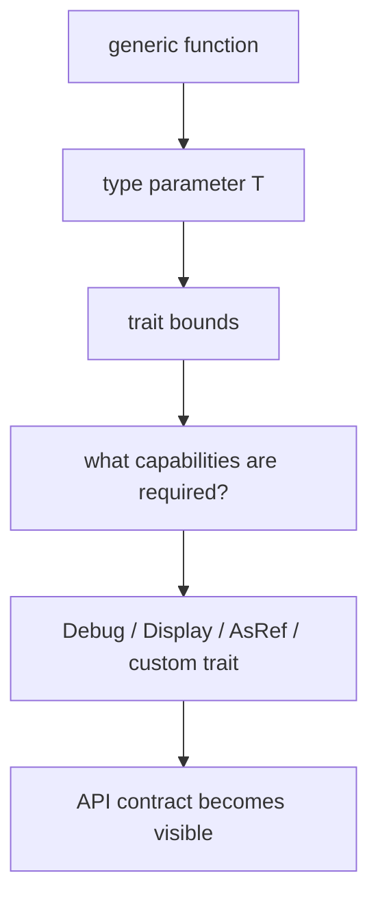

trait와 generic은 처음 보면 "타입을 일반화하는 문법"처럼 보인다. 하지만 실전에서 더 중요한 건 어떤 기능을 요구하는지, 어떤 capability를 계약으로 고정하는지다.

## 문제 제기

같은 함수를 여러 타입에 적용하고 싶을 때 Python은 duck typing, Go는 interface로 접근한다. Rust는 여기에 더해 "이 타입이 정확히 어떤 기능을 제공해야 하는가"를 trait bound로 훨씬 명시적으로 표현한다.

## 왜 필요한가

generic 자체보다 중요한 것은 bound다. `T`가 있다는 사실보다 `T: Summary + Debug`가 어떤 capability를 요구하는지가 API 의미를 만든다.

## Python · Go · Rust 비교

::: code-group
<<< @/snippets/python/protocol_contract.py#protocol-summary [Python]
<<< @/snippets/go/interface_contract.go#interface-summary [Go]
<<< ../../examples/api-contracts/src/lib.rs#summary-trait [Rust]
:::

Rust의 trait는 Go interface처럼 capability를 묘사하면서도, generic bound와 조합되어 호출 시점 계약을 더 구체적으로 드러낸다.

## Trait를 contract로 읽기

### Custom trait

도메인 의미를 가진 capability는 직접 trait로 이름 붙일 수 있다.

<<< ../../examples/api-contracts/src/lib.rs#summary-trait [Rust]

<<< ../../examples/api-contracts/src/lib.rs#note-struct [Rust]

### Trait bound

generic 함수는 "아무 타입이나 받는다"가 아니라 "이 기능들을 제공하는 타입만 받는다"에 가깝다.

<<< ../../examples/api-contracts/src/lib.rs#render-summary [Rust]

### Ergonomic standard traits

`AsRef<str>`는 소유권을 빼앗지 않고 문자열 같은 입력을 유연하게 받게 해준다. `Display`는 사용자 친화적 출력 계약을 만든다.

<<< ../../examples/api-contracts/src/lib.rs#parse-label [Rust]

<<< ../../examples/api-contracts/src/lib.rs#display-badge [Rust]

## Runnable example

<<< ../../examples/api-contracts/examples/capability_contracts.rs#trait-main [Rust]

이 예제는 `Summary`, `Debug`, `AsRef<str>`, `Display`가 각각 어떤 역할을 맡는지 한 흐름으로 보여 준다.

## Compiler clinic

trait와 generic의 에러는 대개 "타입이 틀렸다"보다 "이 함수가 요구한 capability를 그 타입이 제공하지 않는다"는 뜻이다. 다음 배치의 error handling 챕터에서는 `Result`와 custom error를 trait 계약 관점에서 더 깊게 다룬다.

::: warning 흔한 오해
generic을 쓰면 더 추상적이고 어려워진다고 느끼기 쉽다. 하지만 trait bound를 잘 붙이면 오히려 어떤 기능이 필요한지 더 명확해진다.
:::

## 언제 쓰는가 / 피해야 하는가

- custom trait: 도메인 capability를 이름 붙이고 싶을 때
- `Debug`: 내부 상태를 개발자 관점으로 보여주고 싶을 때
- `Display`: 사용자 친화적 문자열 표현이 필요할 때
- `AsRef`: owned/borrowed 입력을 유연하게 받고 싶을 때
- 아직 도메인 의미가 없는데 generic부터 도입하는 습관은 피하는 편이 낫다

## 실무 판단 기준

- concrete type 하나로 충분한 단계라면 generic을 서두르지 않는다. 추상화는 실제 variation이 드러날 때 올리는 편이 낫다.
- trait bound는 최대한 capability 중심으로 좁게 잡고, 구현 세부사항을 새는 bound는 경계한다.
- public API에서는 caller ergonomics와 semver 비용을 같이 본다. bound 하나 추가도 공개 계약 변경일 수 있다.
- `Display`, `Error`, `From` 구현은 편의 기능이 아니라 디버깅과 에러 전파 경험을 결정하는 계약이라는 점을 잊지 않는다.

## Takeaway

- trait는 inheritance 대체재보다 capability contract에 가깝다.
- generic 함수의 핵심은 `T`가 아니라 bound다.
- `Option`, `Result`, custom error도 결국 어떤 계약을 표면에 드러낼지의 문제다.
- 그 연결은 [Option, Result, and Question Mark](/part-3/#option-result-and-question-mark)에서 바로 이어진다.
