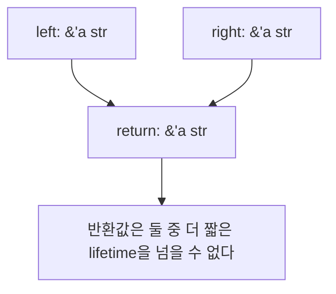

lifetime가 어려운 이유는 문법 자체보다 mental model이 잘못 잡혀 있기 때문이다. lifetime annotation은 메모리를 오래 살려주는 마법이 아니라, "이 반환 reference는 어느 입력 reference에서 왔는가"를 적는 표기다.

## 문제 제기

Python이나 Go에서는 문자열을 비교해서 더 긴 값을 돌려줄 때 별도 annotation이 필요 없다. Rust는 반환 reference의 출처가 둘 중 하나일 수 있기 때문에 관계를 알려줘야 한다.

## 왜 필요한가

이 그림의 핵심은 "둘 다 `'a`만큼 산다"가 아니다. 출력이 입력 둘 중 하나를 가리키므로, compiler는 공통으로 안전한 범위만 허용한다.

## Python · Go · Rust 비교

::: code-group
<<< @/snippets/python/lifetime_aliasing.py#longer-value [Python]
<<< @/snippets/go/lifetime_escape.go#longer-value [Go]
<<< ../../examples/lifetime-lab/src/lib.rs#longest-signature [Rust]
:::

Python과 Go의 예제는 값이나 런타임이 관계를 대신 관리한다. Rust는 그 관계를 시그니처에 드러내면서 반환 참조의 근거를 분명히 한다.

## 1단계: 함수 시그니처에서 관계 읽기

<<< ../../examples/lifetime-lab/src/lib.rs#longest-signature [Rust]

이 함수는 `'a`를 하나만 쓰므로 "반환값은 `left`, `right` 중 더 오래 사는 값"이 아니라 "둘 다 만족하는 안전한 범위 안에 있다"는 의미가 된다.

## 2단계: struct와 method에서 lifetime 읽기

<<< ../../examples/lifetime-lab/src/lib.rs#excerpt-struct [Rust]

<<< ../../examples/lifetime-lab/src/lib.rs#excerpt-method [Rust]

`Excerpt<'a>`는 데이터를 소유하지 않는다. 원본 텍스트가 먼저 살아 있어야 하고, struct는 그 사실을 타입으로 들고 다닌다.

## Runnable example

<<< ../../examples/lifetime-lab/examples/longest.rs#lifetime-main [Rust]

추가로 특정 keyword가 들어간 줄을 돌려주는 함수는 입력 소스에서만 반환 reference가 나올 수 있다.

<<< ../../examples/lifetime-lab/src/lib.rs#keyword-search [Rust]

## Compiler clinic

lifetime를 적어야 하는 상황인데 compiler가 관계를 추론할 수 없으면 다음처럼 막힌다.

<<< ../../examples/ui-harness/tests/ui/borrowed_value_does_not_live_long_enough.rs#missing-lifetime [Rust]

여기서 기억할 점은 "annotation을 더 많이 붙인다"가 아니라 "반환값이 어떤 입력을 가리키는지 시그니처에 드러내라"이다.

::: tip lifetime를 외우지 않는 법

1. output reference가 input reference에서 왔는지 먼저 확인한다.
2. 함수가 데이터를 소유하는지 빌려 쓰는지 구분한다.
3. struct가 reference를 담으면 원본 owner가 누구인지 먼저 생각한다.

:::

## 언제 쓰는가 / 피해야 하는가

- 함수가 입력 reference 중 하나를 그대로 반환할 때
- reference를 담는 struct를 설계할 때
- iterator, parser, zero-copy API처럼 borrow를 오래 유지할 때
- 이해가 안 될 때 무조건 `'static`으로 도망가는 습관은 피해야 한다

## Takeaway

- lifetime는 값을 연장하지 않는다.
- lifetime는 reference 관계를 문서화하고 compiler가 검증하게 만든다.
- "누가 owner인가"를 먼저 잡으면 lifetime 문법은 훨씬 단순해진다.
