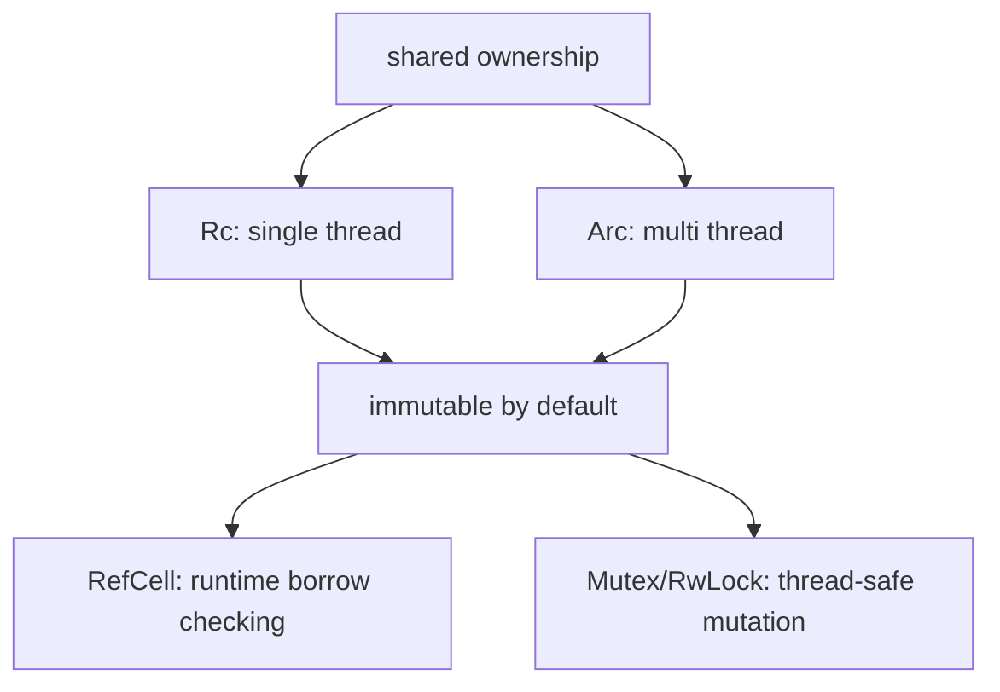

소유자가 하나인 모델은 강력하지만, 그래프 구조, UI state, observer 패턴, 캐시 핸들처럼 여러 핸들이 같은 값을 봐야 하는 순간이 온다. 이때 Rust는 "공유 자체"와 "가변성"을 따로 고르게 만든다.

## 문제 제기

Python에서는 alias가 생기면 그냥 같은 객체를 본다. Go에서는 포인터를 넘기면 공유가 된다. Rust는 여기서 한 번 더 묻는다. "single-thread shared ownership인가", "multi-thread shared ownership인가", "가변성까지 필요한가"를 구분하라는 것이다.

## 왜 필요한가

핵심은 도구를 하나로 외우지 않는 것이다. `Rc`는 소유자 수, `Arc`는 thread boundary, `RefCell`은 mutation 방식에 대한 선택이다.

## Python · Go · Rust 비교

::: code-group
<<< @/snippets/python/shared_ownership.py#shared-ownership-compare [Python]
<<< @/snippets/go/shared_ownership.go#shared-ownership-compare [Go]
<<< ../../examples/shared-ownership-lab/src/lib.rs#shared-review [Rust]
:::

Python과 Go는 alias를 쉽게 만들지만, mutation 제약은 개발자 규율에 많이 의존한다. Rust는 shared ownership과 mutation을 도구 조합으로 분리해서 더 명시적으로 드러낸다.

## 1단계: `Rc<T>`는 single-thread shared ownership이다

`Rc<T>`는 owner를 여러 개로 늘리지만, mutable access까지 허용하지는 않는다. 그래서 `Rc<Vec<String>>`는 공유할 수 있어도 직접 `push`할 수는 없다.

## 2단계: `RefCell<T>`는 runtime borrow checking이다

`RefCell<T>`는 컴파일 타임 대신 런타임에 borrow 규칙을 확인한다. 그래서 `Rc<RefCell<T>>`는 single-thread shared mutable state를 표현할 수 있다.

<<< ../../examples/shared-ownership-lab/src/lib.rs#draft-log [Rust]

<<< ../../examples/shared-ownership-lab/src/lib.rs#shared-review [Rust]

여기서 중요한 건 "규칙이 사라진다"가 아니라 "검사 시점이 런타임으로 옮겨간다"는 점이다.

## 3단계: borrow scope를 작게 유지한다

`RefCell<T>`를 쓰기 시작하면 borrow scope가 길어질수록 panic 가능성이 커진다. 그래서 mutable borrow는 최대한 짧은 블록에서 끝내는 습관이 중요하다.

<<< ../../examples/shared-ownership-lab/src/lib.rs#scoped-borrow [Rust]

## 4단계: `Arc<T>`는 multi-thread shared ownership이다

thread 경계를 넘겨야 한다면 `Rc<T>` 대신 `Arc<T>`가 필요하다. `Arc<T>` 자체는 read-only sharing에 가깝고, mutation까지 필요하면 Part 5의 `Mutex`/`RwLock`과 함께 보게 된다.

<<< ../../examples/shared-ownership-lab/src/lib.rs#arc-thread-share [Rust]

## Runnable example

<<< ../../examples/shared-ownership-lab/examples/shared_review.rs#shared-review-main [Rust]

이 예제는 `Rc<RefCell<T>>`로 single-thread shared mutation을 만들고, `Arc<T>`로 read-only state를 thread에 공유하는 흐름을 함께 보여 준다.

## Compiler clinic

`Rc<T>`만으로는 mutable access를 만들 수 없다.

<<< ../../examples/ui-harness/tests/ui/rc_mutation_without_refcell.rs#rc-mutation-without-refcell [Rust]

이 메시지는 "`Rc`가 부족하다"는 뜻이지 "`unsafe`가 필요하다"는 뜻이 아니다. shared ownership과 mutation이 동시에 필요하면 `RefCell<T>` 같은 별도 계약이 더 필요하다는 신호다.

## 언제 쓰는가 / 피해야 하는가

- `Rc<T>`: single-thread shared ownership이 필요할 때
- `Rc<RefCell<T>>`: single-thread shared mutable state가 필요할 때
- `Arc<T>`: read-only shared state를 thread 경계로 넘길 때
- core domain model 전체를 `Rc<RefCell<T>>`로 감싸는 습관은 피하는 편이 낫다

## 실무 판단 기준

- shared ownership이 필요해 보여도 먼저 owner를 하나로 유지하고 borrowed view로 풀 수 있는지 본다.
- `RefCell<T>`를 쓸 때는 runtime panic 가능성을 감수하는 만큼 borrow scope를 더 짧게 설계해야 한다.
- `Rc<RefCell<T>>`는 GUI tree, graph, observer-like single-thread 구조에서는 유용하지만, 비즈니스 로직 중심 모델에서는 smell이 되기 쉽다.
- `Arc<T>`를 쓰는 순간 thread 경계를 넘긴다는 뜻이므로, 이후 mutation 전략은 Part 5 concurrency 도구와 함께 봐야 한다.

## Takeaway

- `Rc`, `Arc`, `RefCell`은 한 덩어리 기능이 아니라 각각 다른 축의 선택이다.
- shared ownership과 mutation은 분리해서 생각해야 한다.
- interior mutability는 규칙을 없애는 게 아니라 검사 시점을 runtime으로 옮기는 선택이다.
