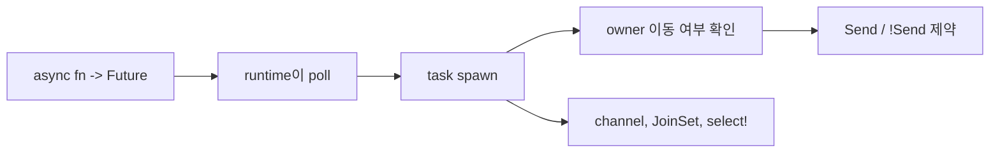

Tokio를 배우기 어렵게 만드는 것은 API 양이 아니라 mental model 차이다. Go에서는 goroutine을 바로 띄우고, Python에서는 coroutine을 event loop에 올리면 되지만, Rust는 task가 이동 가능한지(`Send`)와 어떤 runtime 위에서 poll되는지를 같이 본다.

## 문제 제기

실무에서 async 코드는 대부분 "여러 작업을 동시에 돌리고 결과를 모은다"로 귀결된다. Rust에서는 이때 task가 owner를 어떻게 캡처하는지, channel로 어떤 경계를 만들지, `select!`로 어떤 우선순위를 줄지를 함께 설계해야 한다.

## 왜 필요한가

## Python · Go · Rust 비교

::: code-group
<<< @/snippets/python/async_blocking.py#gather-jobs [Python]
<<< @/snippets/go/goroutine_pipeline.go#worker-pool [Go]
<<< ../../examples/tokio-playbook/src/lib.rs#fanout-function [Rust]
:::

Rust의 차이는 `Future`가 lazy하다는 점과, spawn 시점에 captured state가 다른 스레드로 이동 가능한지 검사한다는 점이다.

## Runnable example

여러 작업을 fan-out 하고, 결과는 `JoinSet`으로 모은다.

<<< ../../examples/tokio-playbook/src/lib.rs#fanout-function [Rust]

동시성 한계를 더 분명하게 주고 싶다면 semaphore로 parallelism을 제한한다. 이때 `Arc<Semaphore>`는 shared mutable state를 숨기는 용도보다, "동시에 몇 개까지 진행할 수 있는가"를 명시하는 용도에 가깝다.

<<< ../../examples/tokio-playbook/src/lib.rs#bounded-fanout [Rust]

작은 메시지는 `mpsc` channel로 흘려 보내고, sender task는 끝날 때까지 명시적으로 join한다.

<<< ../../examples/tokio-playbook/src/lib.rs#channel-function [Rust]

가장 먼저 끝나는 브랜치를 고르는 감각은 `select!`에서 나온다.

<<< ../../examples/tokio-playbook/src/lib.rs#select-loop [Rust]

`select!`는 cancellation의 출발점이기도 하다. 느린 future는 `select!`에서 이기지 못하면 drop되기 때문에, 별도의 abort 스위치를 설계하지 않아도 "못 쓰는 경로"를 정리할 수 있다.

<<< ../../examples/tokio-playbook/src/lib.rs#cancel-slow-work [Rust]

문서 전체 흐름을 한 번에 보면 아래 예제처럼 runtime과 task orchestration을 묶어서 읽을 수 있다.

<<< ../../examples/tokio-playbook/examples/task_orchestra.rs#tokio-main [Rust]

## 3단계: stream-like pipeline을 만든다

실무의 async 흐름은 종종 "입력 스트림을 받고, 조금 가공하고, 다음 단계로 넘긴다"는 모양을 가진다. `mpsc`는 이 흐름을 task 사이 경계로 나눠 주고, bounded queue는 속도 차이를 숨기지 않게 만든다.

<<< ../../examples/tokio-playbook/src/lib.rs#stream-pipeline [Rust]

이 패턴은 service handler, log processing, batch ingestion처럼 한 번에 다 끝내지 않고 계속 흘려보내는 작업에서 특히 유용하다.

## 4단계: graceful shutdown은 control plane이다

shutdown은 data plane을 멈추는 문법이 아니라, 새 작업을 더 이상 받지 않겠다고 알리는 control plane 신호다. `watch`는 이런 신호를 전달하고, producer는 멈추며, worker는 이미 받은 항목을 drain한 뒤 자연스럽게 끝난다.

<<< ../../examples/tokio-playbook/src/lib.rs#stream-pipeline [Rust]

<<< ../../examples/tokio-playbook/examples/stream_shutdown.rs#stream-shutdown-main [Rust]

핵심은 "즉시 kill"이 아니라 "새 입력은 끊고, in-flight work는 정리한 뒤 종료"다.

## 5단계: backpressure를 설계한다

`JoinSet`으로 작업을 많이 던지는 것과, 실제로 동시에 몇 개까지 진행할 수 있는지를 제어하는 것은 다르다. async 시스템에서 자주 터지는 문제는 "작업을 시작하는 속도"가 "처리할 수 있는 속도"보다 빠를 때다.

- `mpsc` channel은 ownership 경계를 메시지로 바꾸는 도구다.
- `Semaphore`는 throughput보다 capacity를 먼저 드러내는 도구다.
- bounded parallelism은 `Arc<Mutex<T>>`보다 의도적으로 제한된 shared resource를 표현하기 좋다.

## 6단계: cancellation은 drop과 timeout에서 시작된다

Tokio에서 cancellation은 거창한 API보다 `select!`와 future drop으로 설명하는 편이 정확하다. 완료되지 않은 future를 더 이상 poll하지 않으면, 그 작업은 사실상 취소된 것이다.

- timeout이 먼저 끝나면 느린 작업은 더 이상 의미가 없다.
- shutdown 신호가 먼저 오면 새 작업을 받지 말아야 한다.
- long-running task는 중간 checkpoint를 두고 자연스럽게 빠져나오게 설계하는 편이 낫다.

## 7단계: `Arc<Mutex<T>>`가 smell인 이유

`Arc<Mutex<T>>`는 틀린 해법은 아니지만, 자주 너무 이른 해법이다. 이 조합은 다음 문제를 숨기기 쉽다.

- 누가 상태를 소유하는지 흐려진다.
- lock scope가 길어지면 contention이 급격히 늘어난다.
- async task 안에서 lock을 오래 잡으면 scheduler fairness를 해친다.
- 사실은 channel이나 state partition으로 풀어야 하는 문제를 mutex로 덮어버리기 쉽다.

권장 순서는 보통 이렇다.

1. ownership transfer가 가능한지 본다.
2. channel로 경계를 만들 수 있는지 본다.
3. semaphore나 bounded queue로 capacity를 드러낼 수 있는지 본다.
4. 정말 shared mutable state가 남았을 때만 `Arc<Mutex<T>>`를 쓴다.

## Compiler clinic

`tokio::spawn`은 기본적으로 `Send` 가능한 future를 요구한다. 그래서 `Rc<T>`처럼 thread-safe하지 않은 상태를 task로 넘기면 막힌다.

<<< ../../examples/ui-harness/tests/ui/tokio_spawn_requires_send.rs#non-send-spawn [Rust]

`tokio::spawn`은 `Send`뿐 아니라 `'static` future도 요구한다. 그래서 task가 지역 변수를 빌려 쓰려 해도 막힌다.

<<< ../../examples/ui-harness/tests/ui/tokio_spawn_borrows_local.rs#borrowed-local-spawn [Rust]

이 에러는 "Tokio가 까다롭다"는 뜻이 아니라, task가 다른 worker thread로 이동할 수 있고 함수 밖으로 오래 살아남을 수 있다는 사실을 trait bound로 드러내는 것이다.

::: warning 자주 하는 실수
`Arc<Mutex<T>>`를 아무 생각 없이 덮어씌우면 Rust async가 쉬워지는 것처럼 보일 수 있다. 하지만 lock 범위와 contention 비용을 숨기기 쉬워서, channel이나 ownership 분리를 먼저 검토하는 편이 낫다.
:::

## 언제 쓰는가 / 피해야 하는가

- `JoinSet`: 독립 작업을 fan-out/fan-in 할 때
- `mpsc`: task 사이 ownership 경계를 메시지로 끊고 싶을 때
- `select!`: timeout, cancellation, first-response-wins 패턴을 표현할 때
- `Rc`를 spawned task로 넘기기: `Send` 제약을 무시하는 대표적인 실수다
- `Semaphore`: 동시에 진행 가능한 작업 수를 명시적으로 제한할 때
- `watch`: shutdown 신호 같은 control plane을 task에 알릴 때

## 실무 판단 기준

- async 코드라고 해서 모든 것을 task로 쪼개지 않는다. 동시성 이득보다 상태 분산 비용이 더 크면 순차 흐름이 낫다.
- `Arc<Mutex<T>>`는 빠른 탈출구이지만, 가능하면 channel로 ownership을 넘기거나 상태를 더 잘게 나누는 구조를 먼저 본다.
- blocking I/O나 CPU 바운드 작업은 runtime worker를 오래 점유하지 않게 분리해야 한다.
- cancellation, timeout, shutdown은 보너스 기능이 아니라 처음부터 제어 흐름에 들어가야 운영 중 사고가 줄어든다.
- backpressure가 필요한 지점은 보통 task 수가 아니라 입력 수용량과 처리율이 어긋나는 지점이다.
- `Arc<Mutex<T>>`를 썼다면 lock의 목적, scope, contention cost를 코드리뷰에서 설명할 수 있어야 한다.
- graceful shutdown은 새 입력을 끊는 시점과 in-flight work를 비우는 시점을 분리해서 설계한다.
- `watch`는 data plane을 흘려보내는 `mpsc`와 역할이 다르다. control plane 신호를 섞지 않는 편이 읽기 쉽다.

## Takeaway

- async Rust는 runtime 개념과 ownership 개념이 합쳐진 모델이다.
- `Send`/`Sync`는 부가 설명이 아니라 task 설계의 핵심 제약이다.
- Tokio API를 외우기보다 "이 future가 어디로 이동할 수 있는가"를 먼저 생각하면 훨씬 덜 막힌다.
