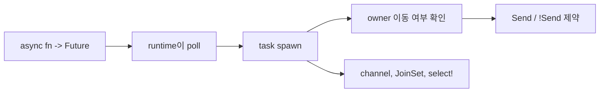

Tokio를 배우기 어렵게 만드는 것은 API 양이 아니라 mental model 차이다. Go에서는 goroutine을 바로 띄우고, Python에서는 coroutine을 event loop에 올리면 되지만, Rust는 task가 이동 가능한지(`Send`)와 어떤 runtime 위에서 poll되는지를 같이 본다.

## 문제 제기

실무에서 async 코드는 대부분 "여러 작업을 동시에 돌리고 결과를 모은다"로 귀결된다. Rust에서는 이때 task가 owner를 어떻게 캡처하는지, channel로 어떤 경계를 만들지, `select!`로 어떤 우선순위를 줄지를 함께 설계해야 한다.

## 왜 필요한가

## Python · Go · Rust 비교

::: code-group
<<< @/snippets/python/async_blocking.py#gather-jobs [Python]
<<< @/snippets/go/goroutine_pipeline.go#worker-pool [Go]
<<< ../../examples/tokio-playbook/src/lib.rs#fanout-function [Rust]
:::

Rust의 차이는 `Future`가 lazy하다는 점과, spawn 시점에 captured state가 다른 스레드로 이동 가능한지 검사한다는 점이다.

## Runnable example

여러 작업을 fan-out 하고, 결과는 `JoinSet`으로 모은다.

<<< ../../examples/tokio-playbook/src/lib.rs#fanout-function [Rust]

작은 메시지는 `mpsc` channel로 흘려 보내고, sender task는 끝날 때까지 명시적으로 join한다.

<<< ../../examples/tokio-playbook/src/lib.rs#channel-function [Rust]

가장 먼저 끝나는 브랜치를 고르는 감각은 `select!`에서 나온다.

<<< ../../examples/tokio-playbook/src/lib.rs#select-loop [Rust]

문서 전체 흐름을 한 번에 보면 아래 예제처럼 runtime과 task orchestration을 묶어서 읽을 수 있다.

<<< ../../examples/tokio-playbook/examples/task_orchestra.rs#tokio-main [Rust]

## Compiler clinic

`tokio::spawn`은 기본적으로 `Send` 가능한 future를 요구한다. 그래서 `Rc<T>`처럼 thread-safe하지 않은 상태를 task로 넘기면 막힌다.

<<< ../../examples/ui-harness/tests/ui/tokio_spawn_requires_send.rs#non-send-spawn [Rust]

이 에러는 "Tokio가 까다롭다"는 뜻이 아니라, task가 다른 worker thread로 이동할 수 있다는 사실을 trait bound로 드러내는 것이다.

::: warning 자주 하는 실수
`Arc<Mutex<T>>`를 아무 생각 없이 덮어씌우면 Rust async가 쉬워지는 것처럼 보일 수 있다. 하지만 lock 범위와 contention 비용을 숨기기 쉬워서, channel이나 ownership 분리를 먼저 검토하는 편이 낫다.
:::

## 언제 쓰는가 / 피해야 하는가

- `JoinSet`: 독립 작업을 fan-out/fan-in 할 때
- `mpsc`: task 사이 ownership 경계를 메시지로 끊고 싶을 때
- `select!`: timeout, cancellation, first-response-wins 패턴을 표현할 때
- `Rc`를 spawned task로 넘기기: `Send` 제약을 무시하는 대표적인 실수다

## 실무 판단 기준

- async 코드라고 해서 모든 것을 task로 쪼개지 않는다. 동시성 이득보다 상태 분산 비용이 더 크면 순차 흐름이 낫다.
- `Arc<Mutex<T>>`는 빠른 탈출구이지만, 가능하면 channel로 ownership을 넘기거나 상태를 더 잘게 나누는 구조를 먼저 본다.
- blocking I/O나 CPU 바운드 작업은 runtime worker를 오래 점유하지 않게 분리해야 한다.
- cancellation, timeout, shutdown은 보너스 기능이 아니라 처음부터 제어 흐름에 들어가야 운영 중 사고가 줄어든다.

## Takeaway

- async Rust는 runtime 개념과 ownership 개념이 합쳐진 모델이다.
- `Send`/`Sync`는 부가 설명이 아니라 task 설계의 핵심 제약이다.
- Tokio API를 외우기보다 "이 future가 어디로 이동할 수 있는가"를 먼저 생각하면 훨씬 덜 막힌다.
